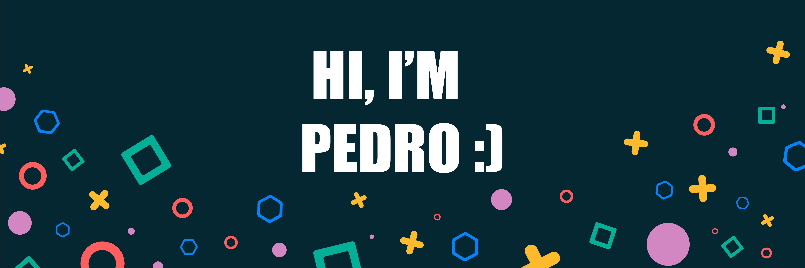

##

| Tools  | Languages | Frameworks  | Technologies |  
|---|---|---|---|
|
&nbsp;&nbsp;&nbsp;&nbsp;
|

|

|
&nbsp;&nbsp;&nbsp;&nbsp;&nbsp;&nbsp;&nbsp;&nbsp;

| 

## 

  
  

##

	<h3 align="center">SoftSkills:<h3>
	
Emotional intelligence
, Communication
, Collaboration
, Critical Thinking
, Creativity
, Leadership

##	

## Connect with me:

  
 	
 
  
   

## ❤ Views and Followers

	
	

 

